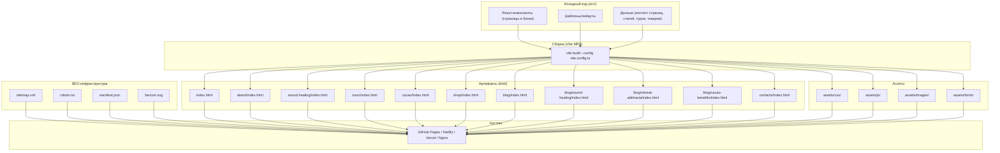

# Техническая архитектура — Премиальный статический сайт (Wellness / Sound Healing / Абхазия)

## 1. Архитектура проекта

Проект — статический многостраничный сайт (MPA), собираемый Vite. Каждая публичная страница является отдельной HTML-точкой входа со своими метаданными (title, description, OG, JSON-LD). React используется как шаблонизатор и для повторного использования компонентов (Header, Footer, SEO-блок и т.д.), но финальный билд — это набор статических HTML + CSS + JS, пригодный для размещения на GitHub Pages, Netlify, Vercel, Cloudflare Pages, обычном Nginx без серверного рендеринга.



## 2. Используемые технологии

- **Сборщик**: Vite 5 (MPA-режим, `rollupOptions.input` с массивом HTML-точек входа).
- **Язык**: TypeScript (strict).
- **UI-фреймворк**: React 18 (только для рендера в build-тайм; в браузере отрабатывает «hydrate»-минимум, основной контент — статический HTML).
- **Стили**: Tailwind CSS 3 + кастомные CSS-переменные для дизайн-токенов (палитра, типографика, spacing).
- **Шрифты**: Google Fonts (Cormorant Garamond, Manrope, Fraunces) с `preconnect` и `display=swap`.
- **Иконки**: `lucide-react`.
- **Маршрутизация**: не используется в рантайме (маршруты = физические HTML-файлы). Для удобства разработки — `react-router-dom` опционально НЕ используется, чтобы сохранить полностью статическую природу.
- **Состояние**: не требуется (stateless сайт). Zustand не используется.
- **Backend**: отсутствует. Форма обратной связи в демо-режиме (валидация на клиенте + сообщение об успешной отправке). При готовности подключается внешний сервис (Formspree, Supabase Functions, собственный backend) — архитектура к этому готова (компонент `<ContactForm />` инкапсулирует логику).
- **Аналитика**: не подключается (демо). Подключение Google Analytics / Plausible — однострочное изменение в `index.html` и точках входа.
- **Хостинг**: статический (GitHub Pages, Netlify, Vercel, Cloudflare Pages, Nginx).

## 3. Структура проекта

```
site/
├── PROJECT.md
├── .trae/
│   └── documents/
│       ├── PRD.md
│       └── ARCHITECTURE.md
├── public/
│   ├── favicon.svg
│   ├── robots.txt
│   ├── sitemap.xml
│   ├── manifest.json
│   ├── assets/
│   │   ├── images/
│   │   │   ├── hero/
│   │   │   ├── gallery/
│   │   │   ├── tours/
│   │   │   ├── author/
│   │   │   ├── products/
│   │   │   ├── blog/
│   │   │   └── og/
│   │   └── icons/
│   └── og/
├── src/
│   ├── main.tsx                   # точка входа для каждой страницы (MPA)
│   ├── pages/                     # компоненты-страницы (по одному на URL)
│   │   ├── HomePage.tsx
│   │   ├── AboutPage.tsx
│   │   ├── SoundHealingPage.tsx
│   │   ├── ToursPage.tsx
│   │   ├── CacaoPage.tsx
│   │   ├── ShopPage.tsx
│   │   ├── BlogIndexPage.tsx
│   │   ├── BlogPostPage.tsx       # переиспользуется для 3 статей через data-slug
│   │   └── ContactsPage.tsx
│   ├── layouts/
│   │   └── SiteLayout.tsx         # Header + main + Footer
│   ├── components/
│   │   ├── seo/
│   │   │   ├── SEO.tsx            # title/description/OG/Twitter/canonical/JSON-LD
│   │   │   └── JsonLd.tsx
│   │   ├── layout/
│   │   │   ├── Header.tsx
│   │   │   ├── Footer.tsx
│   │   │   ├── Breadcrumbs.tsx
│   │   │   └── MobileMenu.tsx
│   │   ├── ui/
│   │   │   ├── Button.tsx
│   │   │   ├── Section.tsx
│   │   │   ├── Container.tsx
│   │   │   ├── Eyebrow.tsx
│   │   │   ├── Heading.tsx
│   │   │   ├── Text.tsx
│   │   │   ├── Card.tsx
│   │   │   ├── Reveal.tsx         # scroll-анимации
│   │   │   └── VideoPoster.tsx
│   │   ├── sections/
│   │   │   ├── HeroHome.tsx
│   │   │   ├── HeroPage.tsx
│   │   │   ├── Directions.tsx
│   │   │   ├── AboutPreview.tsx
│   │   │   ├── UpcomingEvents.tsx
│   │   │   ├── Testimonials.tsx
│   │   │   ├── BlogPreview.tsx
│   │   │   ├── CTASection.tsx
│   │   │   ├── PracticeTypes.tsx
│   │   │   ├── VideoBlock.tsx
│   │   │   ├── ToursList.tsx
│   │   │   ├── CacaoProcess.tsx
│   │   │   ├── ProductGrid.tsx
│   │   │   ├── BlogList.tsx
│   │   │   ├── ArticleBody.tsx
│   │   │   ├── ContactForm.tsx
│   │   │   └── FAQ.tsx
│   ├── data/
│   │   ├── site.ts                # общие данные (название, контакты, соцсети)
│   │   ├── navigation.ts
│   │   ├── directions.ts
│   │   ├── tours.ts
│   │   ├── products.ts
│   │   ├── posts.ts
│   │   ├── testimonials.ts
│   │   ├── events.ts
│   │   └── seo.ts                 # SEO-метаданные всех страниц
│   ├── styles/
│   │   ├── index.css              # Tailwind + кастомные слои
│   │   ├── tokens.css             # CSS-переменные дизайн-системы
│   │   └── typography.css         # @font-face и базовые правила типографики
│   ├── hooks/
│   │   └── useReveal.ts           # IntersectionObserver-обёртка
│   └── utils/
│       ├── format.ts              # форматирование дат, цен
│       └── slug.ts
├── pages/                          # HTML-шаблоны для Vite MPA
│   ├── index.html                  # главная
│   ├── about/index.html
│   ├── sound-healing/index.html
│   ├── tours/index.html
│   ├── cacao/index.html
│   ├── shop/index.html
│   ├── blog/index.html
│   ├── blog/sound-healing/index.html
│   ├── blog/retreat-abkhazia/index.html
│   ├── blog/cacao-benefits/index.html
│   └── contacts/index.html
├── vite.config.ts
├── tailwind.config.js
├── postcss.config.js
├── tsconfig.json
└── package.json
```

## 4. Маршруты (страницы)

| URL | Исходный HTML | Компонент React | Назначение |
|-----|---------------|-----------------|------------|
| `/` | `pages/index.html` | `HomePage` | Главная |
| `/about/` | `pages/about/index.html` | `AboutPage` | Обо мне |
| `/sound-healing/` | `pages/sound-healing/index.html` | `SoundHealingPage` | Sound Healing |
| `/tours/` | `pages/tours/index.html` | `ToursPage` | Туры |
| `/cacao/` | `pages/cacao/index.html` | `CacaoPage` | Какао-церемонии |
| `/shop/` | `pages/shop/index.html` | `ShopPage` | Магазин |
| `/blog/` | `pages/blog/index.html` | `BlogIndexPage` | Блог (лента) |
| `/blog/sound-healing/` | `pages/blog/sound-healing/index.html` | `BlogPostPage(slug: 'sound-healing')` | Статья: Что такое Sound Healing |
| `/blog/retreat-abkhazia/` | `pages/blog/retreat-abkhazia/index.html` | `BlogPostPage(slug: 'retreat-abkhazia')` | Статья: Ретрит в Абхазии |
| `/blog/cacao-benefits/` | `pages/blog/cacao-benefits/index.html` | `BlogPostPage(slug: 'cacao-benefits')` | Статья: Польза какао |
| `/contacts/` | `pages/contacts/index.html` | `ContactsPage` | Контакты |

Каждый HTML-файл в `pages/` подключает `src/main.tsx` с уникальным `data-page` атрибутом (например, `<div id="root" data-page="home"></div>`), а `main.tsx` выбирает нужный корневой компонент.

## 5. Vite-конфигурация (MPA)

`vite.config.ts` настраивает:
- `root: '.'` (по умолчанию);
- `publicDir: 'public'`;
- `rollupOptions.input`: массив путей к каждой точке входа (с использованием `path.resolve(__dirname, 'pages/...')`);
- `build.rollupOptions.output.entryFileNames: 'assets/js/[name]-[hash].js'`;
- `build.rollupOptions.output.chunkFileNames: 'assets/js/[name]-[hash].js'`;
- `build.rollupOptions.output.assetFileNames: 'assets/[ext]/[name]-[hash][extname]'`;
- `resolve.alias`: `@` → `src/`.

Каждая страница при сборке попадает в `dist/<route>/index.html` с относительными путями к ассетам (для совместимости с GitHub Pages, размещёнными в подпапке, и с произвольным доменом).

## 6. SSR / Prerender стратегия

Так как используется Vite + React без Node-сервера, применяется **prerender-подход**: компоненты рендерятся в HTML на этапе сборки через `vite-plugin-ssr` или собственный prerender-скрипт (Node-скрипт, который подключает `react-dom/server`, рендерит каждую страницу и записывает статический HTML с финальными метатегами, OG, JSON-LD). Это гарантирует:
- мгновенную загрузку HTML без «мигания» пустого `<div id="root">`;
- корректный SEO-краулинг (поисковики видят полный HTML);
- минимальный JS-бандл на клиенте (только интерактив: мобильное меню, scroll-анимации, форма).

## 7. Дизайн-токены (CSS-переменные в `styles/tokens.css`)

```css
:root {
  /* Colors */
  --bg-base: #F4ECE0;
  --bg-elevated: #FBF6EE;
  --bg-deep: #1C1A17;
  --ink: #1F1B16;
  --ink-muted: #6B6258;
  --ink-inverse: #F4ECE0;
  --accent-clay: #B5532A;
  --accent-clay-soft: #D27852;
  --accent-rust: #8C3A1F;
  --accent-sage: #6F7A5E;
  --accent-sage-soft: #A6B099;
  --line: rgba(31, 27, 22, 0.12);
  --line-strong: rgba(31, 27, 22, 0.24);

  /* Typography */
  --font-display: "Cormorant Garamond", "Times New Roman", serif;
  --font-body: "Manrope", system-ui, -apple-system, sans-serif;
  --font-accent: "Fraunces", "Cormorant Garamond", serif;

  /* Spacing (4px base) */
  --space-1: 0.25rem;
  --space-2: 0.5rem;
  --space-3: 0.75rem;
  --space-4: 1rem;
  --space-6: 1.5rem;
  --space-8: 2rem;
  --space-12: 3rem;
  --space-16: 4rem;
  --space-24: 6rem;
  --space-32: 8rem;

  /* Radii */
  --radius-pill: 999px;
  --radius-sm: 4px;
  --radius-md: 8px;

  /* Shadows (мягкие) */
  --shadow-sm: 0 1px 2px rgba(31, 27, 22, 0.06);
  --shadow-md: 0 6px 24px -8px rgba(31, 27, 22, 0.12);

  /* Motion */
  --ease-out-soft: cubic-bezier(0.22, 1, 0.36, 1);
  --duration-fast: 180ms;
  --duration-base: 320ms;
  --duration-slow: 600ms;
}
```

Tailwind-плагин расширяет `theme.extend` этими токенами для удобства работы в JSX (`bg-base`, `text-ink`, `font-display` и т.д.).

## 8. SEO-инфраструктура

### 8.1 robots.txt (`public/robots.txt`)
```
User-agent: *
Allow: /

Sitemap: https://example.com/sitemap.xml
```

### 8.2 sitemap.xml (`public/sitemap.xml`)
Генерируется вручную (для 11 страниц) и обновляется при добавлении страниц. Содержит `<urlset>` с `<loc>`, `<lastmod>`, `<priority>`.

### 8.3 JSON-LD
- Главная: `Organization` + `WebSite` (`@graph`).
- Внутренние страницы: `BreadcrumbList` + `WebPage` + специфический тип (`TouristTrip` для туров, `Article` для блога, `Product` для магазина, `FAQPage` для контактов).
- Реализация: компонент `<JsonLd data={...} />` вставляет JSON в `<head>` через `dangerouslySetInnerHTML`.

### 8.4 Open Graph / Twitter Cards
Каждая страница имеет уникальный набор OG-тегов и `summary_large_image` Twitter Card. Изображение по умолчанию — `og-default.webp` (1200×630).

### 8.5 Canonical
Каждая страница имеет `<link rel="canonical" href="https://example.com/<route>/">`.

### 8.6 Breadcrumbs
Визуальный компонент `<Breadcrumbs items={[...]} />` + JSON-LD `BreadcrumbList` синхронизированы.

## 9. Производительность

- Шрифты: `preconnect` к Google Fonts, `display=swap`, подмножества по возможности.
- Изображения: `loading="lazy"`, `decoding="async"`, явные `width`/`height`, формат WebP, плейсхолдеры SVG (без растрового веса).
- CSS: Tailwind purge, минификация.
- JS: код-сплиттинг по страницам (Vite MPA делает это автоматически), только минимальный рантайм для интерактива (мобильное меню, scroll-reveal, форма).
- Анимации: CSS `transform` и `opacity` (GPU-ускорение), `prefers-reduced-motion` учитывается.
- Цель: Lighthouse Performance ≥ 90, LCP < 2.5s, CLS < 0.1, INP < 200ms (на статике достижимо).

## 10. Доступность

- Семантическая разметка: `header`, `nav`, `main`, `section`, `article`, `aside`, `footer`, `figure`, `picture`, `time`, `address`.
- Все интерактивные элементы доступны с клавиатуры (`:focus-visible`).
- ARIA: `aria-label` для кнопок без текста, `aria-expanded` для мобильного меню, `aria-current="page"` для активного пункта меню, `aria-live` для статуса формы.
- Контрастность: текст на фоне ≥ 4.5:1, крупный ≥ 3:1.
- `prefers-reduced-motion` отключает анимации.
- Все формы имеют `<label>`.
- Все изображения имеют `alt`.

## 11. Расширяемость

- **Английская версия**: добавляется через `pages/en/...` + i18n-конфиг (например, `react-i18next` или собственный контекст). Структура URL: `/en/...`. Существующий код страниц не перерабатывается — только оборачивается в language-provider.
- **Новые статьи блога**: добавить запись в `src/data/posts.ts` + создать HTML-обёртку в `pages/blog/<slug>/index.html`.
- **Новые туры/товары**: дополнить `src/data/tours.ts` / `src/data/products.ts`.
- **Форма**: заменить заглушку в `ContactForm.tsx` на вызов внешнего API (Formspree, Supabase, собственный backend).
- **Хостинг**: перенос с GitHub Pages на любой другой хостинг — без изменений кода, только настройка `base` в `vite.config.ts` (если требуется).

## 12. Команды разработки

- `pnpm install` — установка зависимостей.
- `pnpm dev` — локальный dev-сервер на `http://localhost:5173` (multi-page).
- `pnpm build` — продакшен-сборка в `dist/`.
- `pnpm preview` — предпросмотр собранной версии.
- `pnpm typecheck` — проверка TypeScript.
- `pnpm lint` — линтинг (ESLint).

## 13. Безопасность и приватность

- Нет серверной части, нет пользовательских данных.
- Форма обратной связи в демо-режиме не отправляет данные; при подключении внешнего сервиса добавляется CSRF-защита на стороне сервиса.
- `Content-Security-Policy` (опционально, через `<meta http-equiv>` или на хостинге).
- Сторонние скрипты не подключаются.

## 14. Соответствие PRD

Все 11 страниц из PRD реализованы, SEO-метаданные для каждой определены в `src/data/seo.ts`, дизайн-токены соответствуют стилю «Earthen Editorial», архитектура MPA соответствует требованию ТЗ о статическом многостраничном сайте с ЧПУ без `.html` в URL.
