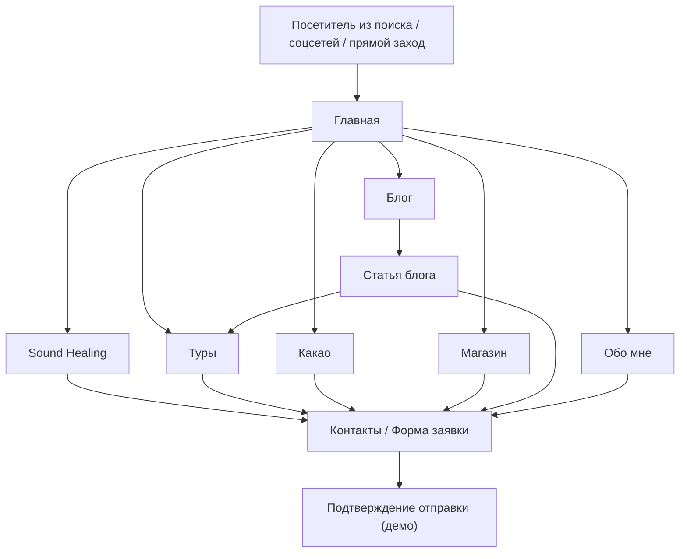

# PRD — Премиальный многостраничный сайт личного бренда (Wellness, Sound Healing, Ethno Tours, Абхазия)

## 1. Обзор продукта

Премиальный статический многостраничный сайт личного бренда в сфере Wellness, Sound Healing, Cacao Ceremonies и авторских этнотуров по Абхазии. Сайт формирует доверие, демонстрирует экспертность, продвигается в поисковых системах и мотивирует оставить заявку на участие в практиках, турах или покупку товаров.

- **Цель**: превращение посетителя в заявку (лид) на практику, церемонию, тур или покупку.
- **Целевая аудитория**: жители России и СНГ, туристы, планирующие отдых в Абхазии, ценители осознанного и медленного отдыха, практики медитации, последователи Sound Healing, участники ретритов.
- **Язык**: русский (архитектура готова к подключению английской версии без переработки).
- **Хостинг**: статический (GitHub Pages → любой другой статический хостинг без изменения структуры).
- **Ценовая категория продукта / позиционирование**: премиум-сегмент; визуальный язык должен соответствовать международным wellness-брендам.

## 2. Ключевые функции

### 2.1 Роли пользователей
Роли не разделяются — сайт публичный, анонимный, без регистрации. Единственный «пользователь» — посетитель, оставляющий заявку через форму обратной связи.

### 2.2 Структура страниц и ключевых модулей

| Страница | Назначение | Ключевые модули |
|----------|------------|-----------------|
| Главная (`/`) | Первое касание; формирование доверия и вовлечение | Hero с УТП; кратко о направлениях; подборки практик/туров; превью блога; CTA на заявку; отзывы |
| Обо мне (`/about/`) | Экспертность, история, ценности | Биография; миссия; сертификаты и опыт; подход; призыв к доверию |
| Sound Healing (`/sound-healing/`) | Подробно о звуковых практиках | Что такое Sound Healing; виды практик (поющие чаши, гонг, тибетские чаши); расписание/форматы; CTA на заявку |
| Туры (`/tours/`) | Каталог авторских этнотуров | Список туров; детали каждого (программа, длительность, что включено); CTA на заявку |
| Какао (`/cacao/`) | Cacao Ceremonies | Что такое церемониальное какао; как проходит церемония; расписание/форматы; CTA на заявку |
| Магазин (`/shop/`) | Витрина товаров (какао, благовония, wellness-продукция) | Список товаров с ценами; оффлайн-оплата по заявке (демо) |
| Блог (`/blog/`) | SEO-журнал | Лента статей с обложкой, заголовком, кратким описанием, датой |
| Статья блога (`/blog/{slug}/`) | Детальная страница статьи | Заголовок; обложка; автор; дата; контент; related-статьи; CTA |
| Контакты (`/contacts/`) | Способы связи и форма заявки | Контактные данные, соцсети; форма «Оставить заявку»; FAQ |

### 2.3 Детальный состав модулей

| Страница | Модуль | Описание |
|----------|--------|----------|
| Главная | Hero | Полноэкранный экран: УТП, подзаголовок, кнопка-CTA, фоновое изображение/видео-постер |
| Главная | Направления | Карточки 4 направлений (Sound Healing, Туры, Какао, Магазин) с иконкой и кратким описанием |
| Главная | Обо мне (превью) | Короткий блок: фото, 2-3 строки, ссылка «Подробнее» |
| Главная | Ближайшие события | Карточки 2-3 ближайших практик/туров |
| Главная | Отзывы | Слайдер или сетка цитат участников |
| Главная | Блог (превью) | 3 свежие статьи |
| Обо мне | Биография | Имя, фото, 2-3 абзаца осмысленного текста |
| Обо мне | Сертификаты/Опыт | Список релевантного опыта и обучения |
| Обо мне | Ценности | 3-4 ключевые ценности бренда |
| Sound Healing | Описание метода | Что это, для чего, как работает |
| Sound Healing | Виды практик | Карточки: поющие чаши, гонг, тибетские чаши и т.д. |
| Sound Healing | Расписание | Ближайшие даты/форматы (демо) |
| Туры | Список туров | Карточки с обложкой, программой, длительностью, ценой |
| Туры | Детали тура (демо-карточка) | Программа по дням, включено, длительность |
| Какао | О церемонии | Что такое церемониальное какао |
| Какао | Как проходит | Пошаговое описание |
| Магазин | Каталог | Сетка товаров с изображением, названием, ценой, кнопкой «Узнать» |
| Блог | Лента | Список статей с обложкой, заголовком, датой, кратким описанием |
| Статья | Контент | Полный текст статьи, обложка, автор, дата |
| Контакты | Форма | Поля: имя, email/телефон, сообщение, согласие |
| Контакты | Контакты | Telegram, email, соцсети |
| Глобально | Шапка | Логотип, навигация, CTA «Оставить заявку», мобильное меню |
| Глобально | Подвал | Краткое меню, соцсети, копирайт, ссылка на политику |
| Глобально | Хлебные крошки | На всех внутренних страницах (кроме главной) |
| Глобально | SEO-блок | Title, Description, OG, Twitter Cards, Canonical, JSON-LD, BreadcrumbsList |

## 3. Ключевые пользовательские сценарии

### 3.1 Сценарий 1 — Турист ищет Sound Healing в Абхазии
1. Пользователь попадает на сайт из поиска по запросу «Sound Healing Абхазия».
2. Видит релевантный Hero с УТП и CTA.
3. Переходит в раздел «Sound Healing», читает о методе и видах практик.
4. Видит ближайшие даты, нажимает «Оставить заявку».
5. Заполняет форму в «Контактах», получает подтверждение (демо-уведомление).

### 3.2 Сценарий 2 — Исследователь блога → этнотур
1. Пользователь читает статью в блоге (например, про Рицу).
2. В конце статьи видит CTA «Хотите увидеть это вживую?».
3. Переходит в раздел «Туры», выбирает подходящий, оставляет заявку.

### 3.3 Сценарий 3 — Покупка товара
1. Пользователь заходит в «Магазин», выбирает товар.
2. Нажимает «Узнать подробнее» (демо-режим).
3. Переходит в «Контакты» и оставляет заявку.

### 3.4 Диаграмма потоков (Mermaid)

## 4. Дизайн интерфейса

### 4.1 Стилистика и направление

**Направление**: «Earthen Editorial» — соединение редакционной журнальной эстетики и тактильной природной палитры Абхазии (горы, море, леса, глина). Спокойный премиум-сегмент; ощущение медленного, осознанного присутствия; много воздуха; типографика как главный визуальный герой.

**Цветовая палитра (CSS-токены)**:
- `--bg-base: #F4ECE0` — тёплый песок (фон по умолчанию)
- `--bg-elevated: #FBF6EE` — светлая слоновая кость (карточки)
- `--bg-deep: #1C1A17` — тёмный уголь (тёмные секции, контраст)
- `--ink: #1F1B16` — основной текст
- `--ink-muted: #6B6258` — вторичный текст
- `--accent-clay: #B5532A` — охра/глина (главный акцент)
- `--accent-sage: #6F7A5E` — шалфей (вторичный акцент)
- `--accent-rust: #8C3A1F` — глубокий терракот (hover/активное)
- `--line: rgba(31, 27, 22, 0.12)` — линии/границы

**Типографика** (Google Fonts, без Inter/Roboto/Arial):
- **Display**: `Cormorant Garamond` (variable, 300–700) — утончённая антиква, журнальный характер.
- **Body**: `Manrope` (300–800) — геометричный, читаемый, с характером.
- **Accent (опционально)**: `Fraunces` (300–900) — переменный, с оптическим размером, для крупных слоганов.

**Кнопки**: скруглённые (радиус 999px для primary, 4px для secondary), без жёстких теней; hover — плавный сдвиг тона и подчёркивание; primary — заливка `--accent-clay`, secondary — outline `--ink`.

**Иконки**: `lucide-react`, line-style, толщина 1.5.

**Стиль макета**: editorial-grid с большим количеством воздуха; крупные номера секций (01, 02, 03); асимметрия; горизонтальные линейки-разделители; full-bleed изображения.

**Декоративные эффекты**: лёгкий film-grain через SVG-noise; плавные gradient-mesh фоны в Hero; плавные scroll-анимации через `IntersectionObserver` (без библиотек).

### 4.2 Обзор дизайна страниц

| Страница | Модуль | UI-элементы |
|----------|--------|-------------|
| Главная | Hero | 100vh, фоновое изображение/постер, заголовок Display 96–128px, подзаголовок Body 18–20px, primary CTA, скролл-индикатор |
| Главная | Направления | Сетка 2×2 (desktop) / 1×4 (mobile), карточки с иконкой, заголовком, кратким описанием, стрелкой |
| Главная | Обо мне (превью) | Асимметричный 12-колоночный grid: фото слева 5/12, текст справа 6/12, линии-разделители |
| Главная | Ближайшие события | Горизонтальный список карточек с датой крупно (Cormorant) |
| Главная | Отзывы | Сетка 3×N, цитаты Display 28–36px, подпись — Body 14px |
| Главная | Блог превью | 3 карточки в ряд, обложка, дата, заголовок, описание |
| Sound Healing | Hero | Уменьшенный hero (60vh) с заголовком и кратким описанием |
| Sound Healing | Виды практик | Сетка 3×N с иконкой, заголовком, описанием |
| Sound Healing | Видео-блок | Постер + play-кнопка, заголовок рядом |
| Туры | Список туров | Вертикальный список full-width карточек, обложка 16:9, программа в виде таймлайна |
| Какао | Описание | Двухколоночный layout: текст + изображение/иллюстрация |
| Магазин | Каталог | Сетка 4×N, карточка с квадратной обложкой, ценой, кнопкой |
| Блог | Лента | Сетка 1×N (editorial), крупная обложка, заголовок, дата, автор |
| Статья | Шапка | Крупный заголовок, подзаголовок, обложка, мета-информация |
| Статья | Контент | Ограниченная ширина 680px, секции H2/H3, выделения, pull-quotes |
| Контакты | Форма | Одноколоночная, поля в стиле underline-only, кнопка primary |
| Глобально | Шапка | Sticky, полупрозрачный фон с blur, логотип-леттеринг слева, меню по центру, CTA справа |
| Глобально | Подвал | Тёмная секция, 4 колонки: о бренде, навигация, контакты, соцсети |

### 4.3 Адаптивность

**Desktop-first** (1280+ → 1920+). Брейкпоинты:
- `≥ 1280px` — полный editorial layout.
- `1024–1279px` — уплотнённые сетки, уменьшенные заголовки.
- `768–1023px` — 2-колоночные сетки, упрощённый hero.
- `≤ 767px` — одноколоночный, мобильное меню (полноэкранный overlay), увеличенные touch-таргеты (минимум 44px).

Touch-оптимизация: увеличенные области нажатия, отключённые hover-эффекты на мобильных, sticky CTA-кнопка.

### 4.4 3D-сцена / видео (по применимости)

3D не используется. Вместо этого:
- Hero на главной: видео-постер с кнопкой play (реальное видео появится позже).
- Раздел Sound Healing: видео-постер с кнопкой play.
- Видео-контейнер: `
` с ``-обложкой, иконкой play, ARIA-меткой.

### 4.5 Изображения и видео (плейсхолдеры)

Все изображения — SVG-плейсхолдеры в стиле «Earthen Editorial»: тёплые природные тона, минималистичные геометрические формы (пейзажные силуэты, тонкие линии горизонта, абстрактные градиенты). Структура:
- `assets/images/hero/placeholder-hero.webp` (1920×1080)
- `assets/images/hero/placeholder-hero-2.webp`
- `assets/images/gallery/placeholder-gallery-01..03.webp` (1200×800)
- `assets/images/tours/placeholder-tour.webp`, `placeholder-tour-2.webp` (1200×675, 16:9)
- `assets/images/author/placeholder-author.webp` (800×1000, 4:5)
- `assets/images/products/placeholder-product-01..04.webp` (800×800)
- `assets/images/blog/placeholder-blog-01..03.webp` (1200×675)
- `assets/images/og/og-default.webp` (1200×630)

Каждое изображение имеет осмысленный `alt` (например, «Sound Healing в горах Абхазии»).

## 5. SEO-метаданные (для каждой страницы)

| Страница | Title | Description | H1 | Ключевые слова |
|----------|-------|-------------|-----|----------------|
| `/` | Sound Healing, этнотуры и какао-церемонии в Абхазии | Премиальные практики Sound Healing, авторские этнотуры по Абхазии и церемонии какао. Осознанный отдых на Черном море и в горах Кавказа. | Sound Healing, этнотуры и какао-церемонии в Абхазии | Sound Healing Абхазия, этнотуры Абхазия, церемониальный какао, медитация, wellness |
| `/about/` | Обо мне — проводник в мире Sound Healing и Абхазии | История, опыт и подход. Кто стоит за практиками Sound Healing, этнотурами и какао-церемониями в Абхазии. | Обо мне | Sound Healing практик, проводник Абхазия, опыт медитации |
| `/sound-healing/` | Sound Healing в Абхазии — поющие чаши, гонг, звуковые практики | Что такое Sound Healing, как проходят сессии с поющими чашами и гонгом в Абхазии. Расписание и запись на практику. | Sound Healing в Абхазии | Sound Healing, саундхилинг, поющие чаши, гонг-медитация, звуковая терапия |
| `/tours/` | Авторские этнотуры по Абхазии — горы, Рица, Кодорское ущелье | Авторские этнотуры по Абхазии: озеро Рица, Кодорское ущелье, Новый Афон, Сухум, Гагры. Программа и запись. | Авторские этнотуры по Абхазии | этнотуры Абхазия, авторские туры, озеро Рица, Кодорское ущелье, путешествие по Абхазии |
| `/cacao/` | Церемониальное какао в Абхазии — какао-церемонии | Что такое церемониальный какао и как проходят какао-церемонии. Польза, формат участия, запись. | Церемониальное какао и какао-церемонии | церемониальный какао, какао церемония, медитация с какао |
| `/shop/` | Магазин — натуральное какао, благовония и wellness-товары | Натуральное церемониальное какао, благовония и wellness-товары. Каталог и заказ. | Магазин | церемониальный какао купить, натуральные благовония, wellness товары |
| `/blog/` | Блог — Sound Healing, Абхазия, осознанный отдых | Статьи о Sound Healing, церемониальном какао, практиках медитации и путешествиях по Абхазии. | Блог | блог Sound Healing, что такое саундхилинг, лучшие места Абхазии |
| `/blog/sound-healing/` | Что такое Sound Healing — как работают звуковые практики | Подробно о Sound Healing: история, влияние на тело и ум, кому подходят звуковые практики. | Что такое Sound Healing | Sound Healing, саундхилинг, звуковые практики, поющие чаши |
| `/blog/retreat-abkhazia/` | Ретрит в Абхазии — практики медитации и этнотуры | Как устроен ретрит в Абхазии: сочетание Sound Healing, какао-церемоний и авторских этнотуров. | Ретрит в Абхазии | ретрит Абхазия, осознанный отдых, медитация Абхазия |
| `/blog/cacao-benefits/` | Польза церемониального какао — зачем участвовать в какао-церемонии | Что даёт церемониальное какао: влияние на тело, эмоции и осознанность. | Польза церемониального какао | польза какао, какао церемония, церемониальный какао |
| `/contacts/` | Контакты — запись на практики, туры и заказ товаров | Как связаться, записаться на Sound Healing, этнотур или какао-церемонию. Форма обратной связи. | Контакты | запись на Sound Healing, контакты Абхазия |

Каждая страница содержит:
- уникальный `<title>`;
- уникальный `<meta name="description">`;
- Open Graph (`og:title`, `og:description`, `og:image`, `og:type`, `og:url`, `og:locale`);
- Twitter Cards (`summary_large_image`);
- `<link rel="canonical">`;
- корректную H1–H3 структуру (один H1);
- Schema.org JSON-LD: `Organization`, `WebSite`, `BreadcrumbList`, `Article` (для блога), `Product` (для магазина), `Event`/`TouristTrip` (для туров);
- Breadcrumbs (визуальные + JSON-LD);
- `alt` для всех изображений;
- `lang="ru"` на `<html>`.

## 6. Нефункциональные требования

- **Производительность**: Lighthouse Performance ≥ 90. Lazy loading для всех изображений, кроме первого экрана. `decoding="async"`. Минимум JS.
- **Доступность**: WCAG 2.1 AA. Все интерактивные элементы доступны с клавиатуры. Контрастность ≥ 4.5:1. ARIA-метки.
- **Кросс-браузерность**: Chrome, Safari, Firefox, Edge — последние 2 версии. iOS Safari, Android Chrome.
- **Хостинг**: статический, GitHub Pages-совместимый, легко переносимый.
- **Код**: TypeScript, читаемая структура, без дублирования CSS/JS, компоненты < 300 строк.
- **Расширяемость**: чистая архитектура для добавления английской версии, новых статей, туров, товаров.

## 7. Этапы разработки

1. Инициализация проекта (Vite + React + TypeScript + Tailwind, MPA-режим).
2. Настройка дизайн-системы (токены, шрифты, базовые стили).
3. Глобальные компоненты (Header, Footer, SEO, Breadcrumbs, Layout, Button, Card).
4. Контентные блоки (Hero, Directions, About, Tours, Cacao, Shop, Blog, Contacts).
5. Страницы (Главная, Обо мне, Sound Healing, Туры, Какао, Магазин, Блог, 3 статьи, Контакты).
6. SEO-инфраструктура (sitemap.xml, robots.txt, JSON-LD, OG, Twitter Cards).
7. Адаптивная вёрстка и финальная полировка.
